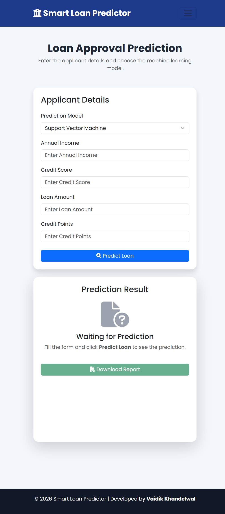
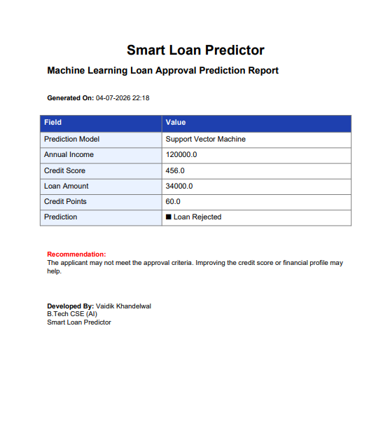

# 🏦 Smart Loan Predictor

A Machine Learning-powered web application that predicts whether a loan application is likely to be approved based on applicant details. The application is built using **Flask** for the backend and **HTML, CSS, Bootstrap, and JavaScript** for the frontend.

---

## 📌 Features

- 🤖 Loan Approval Prediction using Machine Learning
- 🔄 Choose between:
  - Logistic Regression
  - Support Vector Machine (SVM)
- 📊 User-friendly and responsive interface
- 📄 Generate and download a PDF report of the prediction
- 📱 Responsive design for desktop and mobile devices

---

## 🖥️ Project Demo

### Home Page
> Add a screenshot here

```
images/home.png
```

### Prediction Page
> Add a screenshot here

```
images/prediction.png
```

### Prediction Result
> Add a screenshot here

```
images/result.png
```

---

## 🛠️ Tech Stack

### Frontend
- HTML5
- CSS3
- Bootstrap 5
- JavaScript

### Backend
- Flask
- Python

### Machine Learning
- Scikit-learn
- NumPy
- Pandas
- Joblib

### PDF Generation
- ReportLab

---

## 📂 Project Structure

```
loan_approval/
│
├── app.py
├── requirements.txt
├── README.md
│
├── model/
│   ├── log_load.lb
│   └── sv_load.lb
│
├── utils/
│   └── pdf_generator.py
│
├── templates/
│   ├── base.html
│   ├── home.html
│   ├── prediction.html
│   ├── about.html
│   └── contact.html
│
├── static/
│   ├── css/
│   ├── js/
│   └── images/
│
└── reports/
```

---

## ⚙️ Installation

### 1. Clone the repository

```bash
git clone https://github.com/Vaidikkh/loan_approval_prediction.git
```

### 2. Move into the project directory

```bash
cd loan_approval_prediction
```

### 3. Create a virtual environment

```bash
python -m venv .venv
```

### 4. Activate the virtual environment

#### Windows

```bash
.venv\Scripts\activate
```

#### Linux / macOS

```bash
source .venv/bin/activate
```

### 5. Install dependencies

```bash
pip install -r requirements.txt
```

### 6. Run the application

```bash
python app.py
```

The application will be available at:

```
http://127.0.0.1:5000
```

---

## 📊 Machine Learning Models

The project uses two supervised classification algorithms:

### Logistic Regression
- Fast and lightweight
- Suitable for binary classification

### Support Vector Machine (SVM)
- Effective for complex decision boundaries
- High prediction accuracy

---

## 📥 Input Features

The prediction model uses the following features:

| Feature | Description |
|----------|-------------|
| Income | Annual income of the applicant |
| Credit Score | Applicant's credit score |
| Loan Amount | Requested loan amount |
| Credit Points | Creditworthiness score |

---

## 📄 PDF Report

After prediction, users can download a PDF report containing:

- Selected model
- Applicant details
- Prediction result
- Recommendation
- Date and time

---

## ⚠️ Note

This project was developed for educational purposes.

The machine learning model predicts based on the training dataset and should **not** be considered a real banking loan approval system.

---

## Images 





## 🚀 Future Improvements

- User Authentication
- Database Integration
- Prediction History
- Dashboard & Charts
- Explainable AI (Feature Importance)
- REST API
- Cloud Deployment

---

## 👨‍💻 Author

**Vaidik Khandelwal**

B.Tech CSE (Artificial Intelligence)

GitHub: https://github.com/Vaidikkh

---


## ⭐ Support

If you found this project useful, consider giving it a ⭐ on GitHub.